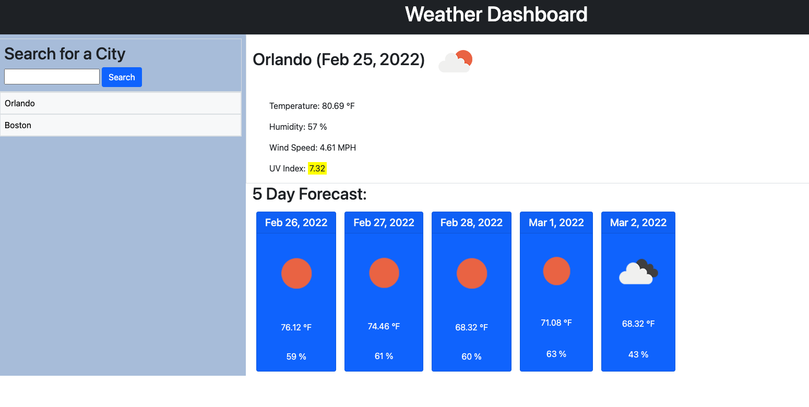

# Weather Dashboard

## Description
Build a weather application that will run in the browser in order to successfully plan a trip.

## Criteria
- When a city is search it will display current and future conditions for that city and the city is added to the search history
- City name, date, icon of weather condition, temperature, humidity, wind speed and uv index will also be displayed
- UV index will present a color indicating if conditions are favorable (green), moderate (yellow) or severe (red)
- 5 day forcast will display the date, icon of weather conditions, temperature and humidity
- When search history is clicked, current and future conditions for that city will be displayed

## Screenshot

## Deployed Page
https://chindatrate.github.io/weather-dashboard/

## GitHub Repository
https://github.com/chindatrate/weather-dashboard
